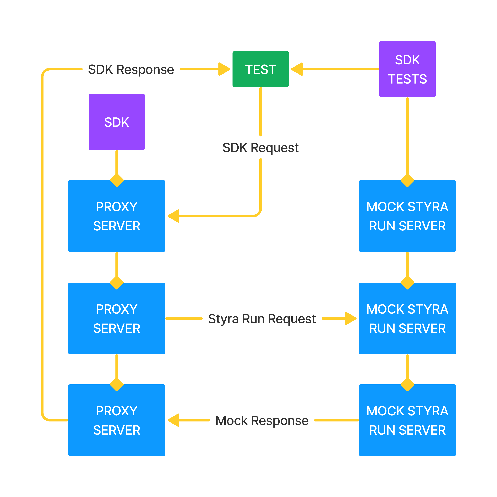

# styra-run-sdk-tests

This repository serves as a single source of truth for how Styra Run SDKs should be tested. Specifically, this repository tests the HTTP proxy implementations of all Styra Run client and RBAC functions.

## Overview

Each SDK must host an HTTP server that serves all HTTP proxy implementations at well-defined routes (see below). The unit test suite will then issue requests to the SDK, masquerading as the Styra Run backend, intercepting and verifying Styra Run requests, and verifying the final SDK response. The following image shows the flow for a single test:

## Proxies

The following sections list the SDK operations and corresponding routes that each SDK must support. For specifics on the semantics of each operation, please see the [README](https://github.com/StyraInc/styra-run-sdk-go) and code for the `golang` SDK as the source of truth.

### Client

| Proxy | Method | Route |
| --- | --- | --- |
| `GetData` | `GET` | `/data/{path}` |
| `PutData` | `PUT` | `/data/{path}` |
| `DeleteData` | `DELETE` | `/data/{path}` |
| `Query` | `POST` | `/query/{path}` |
| `Check` | `POST` | `/check/{path}` |
| `BatchQuery` | `POST` | `/batch_query` |

### RBAC

| Proxy | Method | Route |
| --- | --- | --- |
| `GetRoles` | `GET` | `/roles` |
| `ListUserBindingsAll` | `GET` | `/user_bindings_all` |
| `ListUserBindings` | `GET` | `/user_bindings` |
| `GetUserBinding` | `GET` | `/user_bindings/{id}` |
| `PutUserBinding` | `PUT` | `/user_bindings/{id}` |
| `DeleteUserBinding` | `DELETE` | `/user_bindings/{id}` |

## Running the test suite

To run the unit test suite, perform the following steps in order:

1. Boot your SDK's proxy server on `localhost:3000`. Set the Styra Run url to `localhost:4000`.
2. From within the unit test suite, run `go test tests/sdk_test.go`.
3. Tear down your SDK server.

Note that the unit test suite should be included as a `git` submodule for testing on GitHub.
